# Regex Explained

## What is Regex? 

### Regex stands for Regular Expression and are patterns used to match character combinations in strings.  

## Summary

Today I will be breaking down regex expressions used for passwords. 
In the following information, we will break down the regex code for passwords.

The password must match:

* Exactly 8 characters,
* must contain at least 1 uppercase letter,
* must contain at least 1 lowercase letter, and 1 number
* Can contain any of this special characters $ % # * & - .

Let's use the following password in our exmaple: 

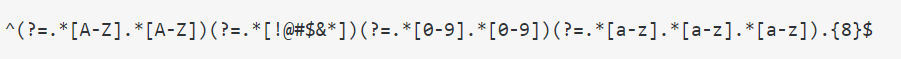

## Table of Contents

- [Anchors](#anchors)
- [Quantifiers](#quantifiers)
- [Character Classes](#character-classes)
- [Grouping and Capturing](#grouping-and-capturing)
- [Back-references](#back-references)
- [Look-ahead and Look-behind](#look-ahead-and-look-behind)

## Regex Components

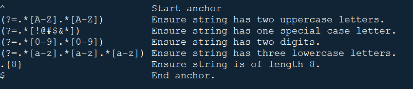

### Anchors

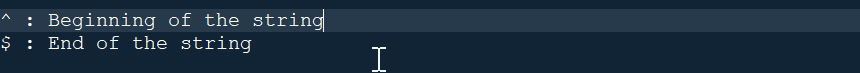
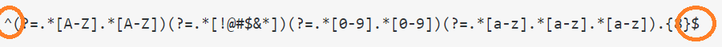

### Quantifiers

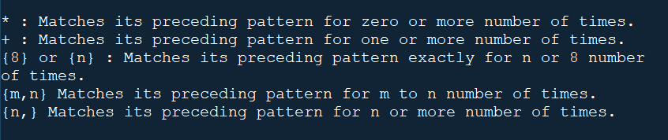
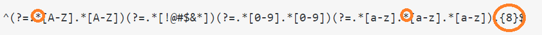

### Character Classes

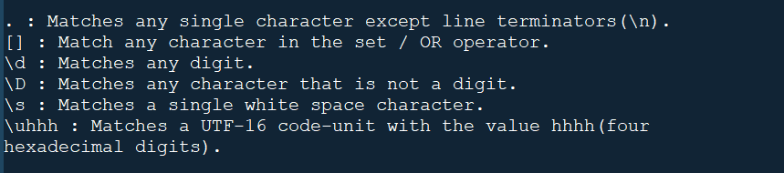
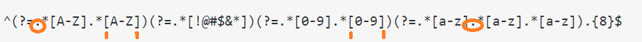

### Grouping and Capturing

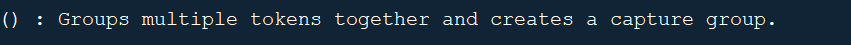
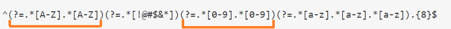

### Back-references

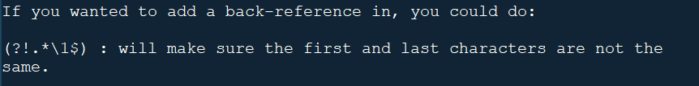

### Look-ahead and Look-behind

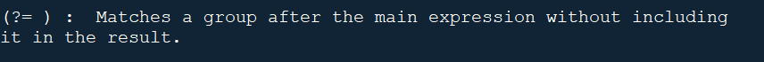
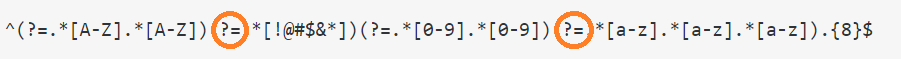

## Author

#### Angela Gola
#### Full-Stack Junior Web Developer

  * [GitHub](http://github.com/angelagola-ko)

  * [Email: angelagola.ko@gmail.com](mailto:angelagola.ko@gmail.com)
#### &copy;2022 All Rights Reserved

.
